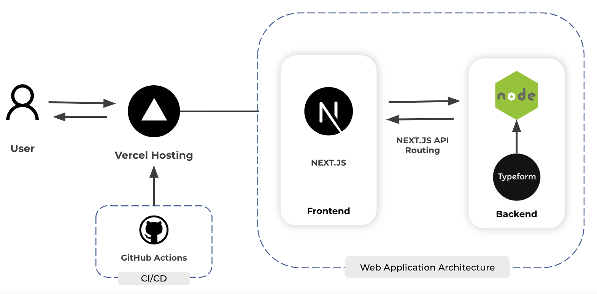

## Getting Started

## ALS Resource App

### Project Description

People with ALS around the world are not offered a variety of clinical options. There are dozens of opportunities for what could be the most beneficial option to them, but are usually only offered a few. The goal is to take clinical decision making and turn it into a tool that allows ALS patients to look at options and discuss them with their clinician (I have questions about a, b, and c). This tool/guide will allow people with ALS and clinicians/clinics to collaborate in the process of identifying best options throughout the disease process. Tools, resources, and methodologies are continually evolving to help people with ALS to cope with their condition. Because of the rapid nature of development(s), communicating updated resources to both clinicians and patients is difficult.

The two primary users of this application (mobile or web app) would be patients with ALS or clinicians who work with ALS patients on occasion (such as primary care physicians etc). The goal would be to provide them with a guided system that is constantly updated with the latest information. Each answer to a question or series of questions would lead the user down a different branch of questions and finally suggestions for the patient's current condition. The end goal would be creating a platform that helps distribute the information to patients and clinicians who might not have access to clinics with ALS experts.

### User Stories

As a patient, I want to have the most up-to-date solutions for questions I may have so that I can be sure I am receiving relevant and researched treatments.

As a clinician, I want to have the most up-to-date solutions for questions so that I am giving the proper treatment for my clients' problems.

As a patient, I want to be able to save the resources and articles I’m recommended in the application so that I can access them at a future date.

As an admin, I want to be able to edit the ordering of questions along with the content in an intuitive and easy manner so that I can manage the application

### Run Project

Frontend: <br>
nagivate to \code <br>

```bash
npm install
npm run dev
```

Backend: <br>

Backend is hosted on Typeform.

## Getting Started

### Architecture

Here is the Spring 2024 Midterm [slides](https://docs.google.com/presentation/d/14D7LLQVyJqyRsZOZrKRtz57jpahWUS9vqxkEOyitveg/edit?usp=sharing) that go over the project.

Below is a screenshot of the OLD architecture using Strapi. Please see the README is old-backend-strapi for more details.


Below is a screenshot of the NEW architecture using Typeform.



### Files

To modify components you can go to /src/components. Details for the components, constants,
images and styles are in the ComponentDocs.md files.

### Pages and Utils

To understand the utils, Typeform API, and pages, naviagte to the the Pages&UtilsDocs.md file in src.

### Extendability

1. Database: The code for storing the data in a database (for this code it is mongodb) has been provided. Since it was not required to do so for our project, we did not do so but for future teams, they can modify this code data storage.

2. Deployment on cloud: The application can easily be deployed on a cloud provider. The tests help users see if the code breaks or not. During the semester, we hosted our test versions for the client on Vercel, which provides automatic CI/CD

3. Code modification: We have written modular code written, dividing code into components and classes. Furthermore, detailed explanations for each class can be provided below and on the application.

Below is a detailed explanation of components and pages, which can also be found in their respective READMEs.

### Components

Below is the file structure of the components. Most components rely on global styles, which are available in the utils folder. Most components also require additional static styling, which is including in the .css files in the same sub-directory. Some components, like Title require dynamic styling, which is instead created using mantine in a .tsx file.

File Structure:

- code/
  - components/
    - BookmarkButton/
      - BookmarkButton.tsx
      - BookmarkButton.module.css
    - CopyURL/
      - CopyUrl.tsx
      - CopyUrl.module.css
    - Footer/
      - Footer.tsx
      - FooterStyle.tsx
    - Navbar/
      - Nav.tsx
      - Nav.module.css
    - NavList/
      - NavList.tsx
      - NavList.module.css
    - ResourcesHandouts/
      - ResourcesHandouts.tsx
      - ResourcesHandoutsStyle.tsx
    - SolutionPage/
      - SolutionPage.tsx
      - SolutionPage.module.css
    - Title/
      - Titles.tsx
      - TitleStyle.tsx
    - Fall2023ComponentDocs.md
    - Spring2024ComponentDocs.md

### Header

     * Nav.tsx
        * Styles
            - custom styles for the header
            - wrapper for the logo
            - styles for props inside the title
        * Links
            - list of links appearing in the drop-down menu
            - maps each link to a title with a link
            - currently statically included in file
        * Burger
            - uses mantine Burger component
            - Click to display drop-down menu
            - Drop-down items inherent toggle function to closer Burger
        * Returns a <div> with the logo and Burger
     * NavList.tsx
        * Styles
            - styles for list container
            - styles for each list items
            - individual styling for last link item
        * Links
            - object with title, link, and onClick function
            - currently only maps to home and bookmarks
            - passed in as params
            - currently statically encoded in Nav.tsx
        * onClick function
            - receives an onClick function from Nav.tsx
            - all current links use the toggleMenu function from Nav.tsx
            - allows for more dynamic behavior in future iterations
     * Titles.tsx
        * useStyles
            - custom styles for titles (position, size, color)
            - chevron icon (transition, position, color)
            - wrapper (background image, size, position, height, padding)
            - inner (position, width, height, zIndex)
            - title (font weight, size, style, letterSpacing, paddingRight, color, marginBottom, textAlign, fontFamily, lineHeight)
            - media queries for smaller than 'xs' screen sizes
        * Title component
            - displays the title passed as a prop
            - applies custom styles from useStyles
        * ChevronIcon
            - displays only if hasPrev is true
            - onClick triggers prevQuestion function
        * Return a <div> that contains the ChevronIcon and the Title component

### Body

     * CopyURL
        * Styles
            - coloring for the button
            - styling for text input
        * URL encoding
            - the link encodes saved bookmarks by id
            - on load, a useEffect will parse and add the bookmarks to a global context
            - enables link sharing across devices
            - displayed link uses base URL, make sure you change it when deploying
        * Overrides local storage
            - a useEffect also reads saved bookmarks from local storage
            - locally stored bookmarks will automatically be encoded in the displayed URL
            - if there are local bookmarks when an encoded url is used, they will be wiped
            - may be worth discussing with client if URL encoding should take precedent
        * Copy button
            - clicking the button automatically loads URL to clipboard
            - changes color to indicate when clicked
            - also highlights the url in the form
        * Return a <div> that contains the copyable link and copy button
     * ResourcesHandouts
        * handleBookmarkClick
            - sends user back to the communication branch
            - currently is statically encoded, next teams will need to send back to respective source branch
            - sets the value of a global context to a clicked solution, see context documentation for more info
        * useStyles
            - follows global styling conventions for inner and outer, see utils for more details
            - styling for container for link portion
            - styling to wrap the BookmarkButton
            - assumes BookmarkButton isSolutionPage is false when rendered on /bookmark
            - assumes BookmarkButton isSolutionPage is true when rendered on /communication
            - only gets rendered to display solutions or bookmarks
        * Solution button
            - routes the user back to /communication with the solution state loaded
            - dependent on the focused bookmark context, see context documentation for more info
            - used to hold a link to the external solution itself, see old component documentation
        * BookmarkButton with conditional rendering
            - always renders the save/unsave button, conditionally renders the 'Go to bookmarks' button
            - renders 'Go to bookmarks' button on SolutionPage components, not on bookmark page
            - clicking save adds the resource id to the global context holding bookmarks
            - click unsave removes the the resource id from the global context
        * Return a <div> containing a list of resources with a corresponding link
     * BookmarkButton
        * useStyles
            - uses the inner style for both buttons
            - all other styles come from CSS file
        * Styles
            - styles for text contained within buttons
            - container for bookmark navigation button
            - container for save/unsave button
        * handleBookmarkClick
            - creates a new bookmark with id, title, and url
            - adds newly created bookmark to global bookmark context
            - if bookmark is already in context, removes it instead
            - see context docs for more information
        * Conditional button rendering
            - button is used on SolutionPage and bookmark page
            - only render navigate to bookmark page on the SolutionPage instances
            - button containers subject to page styles
            - may be better to split into two components in the future, SaveButton and BookmarkNavButton
        * Returns a <div> containing a save button and conditionally a bookmark nav button
     * SolutionPage
        * Video display
            - renders a video if it exists
            - solution content is passed in as a prop
            - solution content is originally retrieved from Typeform
            - uses global styling, see utils for more info
        * Resource map
            - Maps out a list of resource links
            - Links map to external video or article
            - Uses global styles and additional custom styles
            - May be replaceable with a ResourcesHandout
        * BookmarkButton
            - Renders a save/unsave button using global styling
            - Renders the 'Go to bookmarks' button, also fitted with global styling
            - Bookmarks can also be removed from the SolutionPage
            - See context docs for how bookmarks are added and removed from global context
        * Returns a <div> containing the corresponding solution and a BookmarkButton

### Footer

     * Footer.tsx
        * useStyles
            - custom styles for footer (flex, center, padded)
            - logo
            - grouping links using flexbox and flexwrap
            - links are colored #FFFFFF, inter font, style normal
            - on hover underline
        * Loop through groups, make a <Text> component for mantine.Link
        * Dynaically expands and shrinks to fit the size of the page no matter how many resources or bookmarks
        * return <div> with all the links

### Pages and Utils

Below is the file structure of the pages and utils. Most pages rely on global styles, which are available in the utils folder. Most components also require additional static styling, which is including in the .css files in the /styles directory.

File Structure:

- public/

  - best_childrens_hospital_us_news.png
  - Boston_Children's_Hospital_logo.png
  - communications.png
  - copy-icon.svg
  - doctor.png
  - favicon.ico
  - favicon.png
  - footerImg.png
  - friends.png
  - home.png
  - titleImgCommunication.png
  - titleImgHome.PNG

- src/
  - pages/
    - api/
      - retrieveQuestions.tsx
    - \_app.tsx
    - bookmarks.tsx
    - communication.tsx
    - index.tsx
    - questionnaire-page.tsx
    - resource-link-gen.tsx
  - styles/
    - Bookmark.module.css
    - Communication.module.css
    - Globals.css
    - Home.module.css
    - ResourceLinkGen.module.css
  - utils/
    - BodyContentStyle.tsx
    - GetSolutionPageForChoice.tsx
    - QuestionUtils.tsx
    - Pages&UtilsDocs.md
  - Pages&UtilsDocs.md

### Pages

    * api/retrieveQuestions.tsx
        * Utility functions
            - getYouTubeEmbedUrl: Converts standard YouTube URLs to their embed form
            - extractBetweenResources: Extracts the content between specific tags within a text string
            - removeResourcesSection: Removes the section identified by specific tags from the text string
        * API route handler retrieveQuestions
            - Handles requests to the /api/retrieveQuestions endpoint.
            - It expects a query parameter flowName to determine which form questions to retrieve
            - Processes the communication flow name, returns "Invalid flowName" error until other branches are added
        * Fetching data
            - Performs an asynchronous fetch request to the Typeform API using form IDs defined in globals
            - Transforms the response into a structure defined by IQuestionList and IQuestion
            - Responds with newly constructed objects, see type definitions for more details
    * _app.tsx
        * MantineProvider
            - Provides global styles and normalization of CSS across the application
            - Encapsulates the whole application
        * Nav component
            - Displays the navigation bar consistently across all pages
            - Contains hamburder to display the options on-click
        * Context Providers
            - Wraps the content with BookmarkProvider and FocusedBookmarkProvider
            - Passes bookmark-related global states down to the bookmark page
    * bookmarks.tsx
        * URL encoding and loading
            - On page load, bookmarks are fetched and added through URL encoding
            - Fetches data using the fetchAndAddBookmarks function inside a useEffect
            - Sets a loading state while bookmarks are being retrieved
        * Bookmarks categorization
            - Sorts and categorizes bookmarks into predefined groups such as Communication
            - Uses a forEach loop to push bookmarks into their respective array and checks for correct key values
        * Bookmark URL construction
            - Constructs a shareable URL with encoded bookmark IDs.
            - The URL reflects the current state of bookmarks allowing them to be shared across devices
            - Updates the URL state whenever bookmarks change, and prevent infinite useEffect loop
        * EncodedUrlDisplay subcomponent
            - Renders a text prompt for saving resources
            - Displays the encoded URL which users can copy to save their bookmark state
            - Uses the CopyableLink component to display the URL
    * communication.tsx
        * Local storage utilities
            - Provides saveToLocalStorage and loadFromLocalStorage functions to load states and bookmarks
            - Ensures survey progress and bookmarks are saved on page reload, but is overridden by URL encoding
        * Reset notification
            - Notifies the user when a change has been made in Typeform that is not reflected on their website
            - Asks that the user reload the page to maintain consistency with the backend
            - Dismisses the notification after a few seconds to ensure it is not too distracting
        * Initial choices state
            - Defines a base state for choices using initialChoices
            - These choices act as the starting point for the communication questionnaire
            - If there are choices saved in local storage upon reload, loads them
        * Question state management
            - Manages the state of the current question, available choices, and the question timeline
            - Includes logic to handle transitions between questions based on user interaction
            - Loads question from local storage if it exists
        * SolutionPage rendering
            - Conditionally renders SolutionPage when a leaf in the question tree is reached
            - Passes the content down to the component, see component for more details
            - SolutionPage ids get preserved in the FocusedBookmark context for navigation to /communication
        * Question fetching and state
            - Fetches question list from an API and updates local storage accordingly
            - Checks for typeform consistency and updates the UI if changes are detected
        * Choice handling
            - Handles user's choice clicks and determines the next question or solution to display
            - Provides a notification if logic is not set on the backend for a given choice
            - Loads choices from local storage if they exist
    * index.tsx
        * QuestionaireBodyContent component
            - Contains logic to navigate to /communication or other base branches
            - Should be eventually used in place of /communication
            - Used to contain the functionality used by the old team
    * questionaire-page.tsx
        * State initialization
            - Initializes state with useState for currQuestion representing the current question being displayed
            - Sets currChoices state to hold an array of initial choices for the questionnaire
            - Uses the default category questions, containing the respective ids from the previous Strapi backend
            - Rather than updating the state, simply navigates to /[choice]
    * resource-link-gen.tsx
        * State management
            - Manages an array of inputFields in state to dynamically handle multiple input pairs for titles and URLs
            - Maintains a generatedJson string state that stores the resulting JSON for use in Typeform solutions
            - The link can be used in the Typeform backend to render a video on a SolutionPage
        * JSON generation
            - A handleGenerateJSON function creates a JSON string of the input, pre- and post-fixed with identifiers for use in Typeform
            - Filters out any input fields that are empty before generating the JSON
            - See documentation on using videos in Typeform for more information on using the JSON construct
        * CopyableLink component
            - Renders the CopyableLink component with the generated JSON for easy copying
            - Conditionally displays the CopyableLink component only when generatedJson has content
        * Temporary resolution
            - This is our temporary solution for allowing the client to add videos in Typeform
            - Putting in a title and URL correctly formats the object needed in Typeform to render a video
            - This is a temporary solution in lieu of a custom backend that can handle this more cleanly
            - Typeform is also limited to one video per page, which is another reason a custom backend is needed

### Utils
    * apiUtils.tsx
        * getYouTubeEmbedUrl
            - Returns the YouTube embed URL for a given YouTube video either in short form or long form.
        * extractBetweenResources
            - Returns the text value between [*resources*] tags that are passed in the description, typically pasted from /resource-link-gen
        * removeResourcesSection
            - Returns the text value without [*resources*] tags and the content inside the tags that are passed in the description, typically pasted from /resource-link-gen
    * BodyContentStyle.tsx
        * Common style traits
            - Establishes consistent color schemes and border styles
            - Implements responsive design traits that adapt to smaller screens
        * Inner style
            - Styles for button-like components, ensuring they are properly sized within their wrappers
            - Defines hover effects that change background and text color
        * Chevron style
            - Provides a specific style for chevron icons used in the Title
            - Includes a transition effect
        * Text styles
            - Defines the main text style used throughout the application
            - Ensures text elements maintain their style on smaller devices
        * Description text style
            - Sets a slightly smaller and lighter style for description text to differentiate them from primary text
            - Maintains consistent alignment and font traits with the main text style
        * Outer container style
            - Styles the outermost container of components to properly align content within the layout
        * Bookmark container style
            - Customizes the look for bookmark display
            - Ensures that the container is large enough
        * Copy icon style
            - Defines styles for icons used in copy functionalities
            - Ensures copy buttons are visually identifiable within the rest of the applicable
    * QuestionUtils.tsx
        * Typeform consistency check
            - Defines isTypeformConsistent to compare two sets of typeform data, primarily by comparing the length and the individual questions for equality
            - Useful for detecting changes in questionnaire content over time or between different sessions
        * Question equality
            - Defines areQuestionsEqual to determine if two questions are identical by comparing various properties including IDs, titles, references, types, descriptions, choices, solutions, and attachments
            - Ensures perfect equality checks within question sets
        * Choices equality
            - Defines areChoicesEqual to check if two arrays of choices are equal by comparing their IDs, labels, and references
            - Ensures validation of choice arrays within question comparison operations
        * Solutions equality
            - Defines areSolutionsEqual to verify if two arrays of solutions are the same, comparing each solution's ID, title, and URL
            - Ensures consistency in solutions that may be attached to questionnaires
        * Attachments equality
            - Defines `areAttachmentsEqual` for comparing two attachments based on their type and href properties
            - Ensures attachments linked to questions are maintained across updates

### Tests

Docs Written by @jacob-stein1, contact for assistance
DOCUMENTATION

We have written test cases to check the rendering of components, the function of contexts, and more. Testing is written using the Jest JavaScript testing framework. See their [documentation](https://jestjs.io/docs/getting-started) for more info.

Tests are contained within a '**tests**' directory within each sub-directory of the project. For example /pages/**tests**/'page'.test.js contains the test cases for each page in the pages directory.

To run all tests:

$ npm run test

### Recommended Next Steps

- Currently only data for the communication branch is contained in Typeform. Moving the rest of the data from the Figma drawing, or from the client, would be a good step before setting up the next branches.
- QuestionnairePage is a placeholder for making dynamic routing for the four main routes. We recommend using Nextjs dynamic routing to make [id].tsx where id is the four main branches. You can see the dev branch, which is Fall 2023's branch, where they partially implemented dynamic routing.
- Typeform is a temporary solution. We were advised to make a full custom backend using ReactFlow, but we did not have enough time to make it this semester. Implementing a custom backend using Typeform-esque logic will overcome problems like only being able to render one video at a time

### Summary of we did

- Migrated questions, answers, and solutions from Strapi to Typeform
- Created bookmark saving capacity using contexts
- Created URL encoding to share resources across devices
- Added localStorage saving for bookmarks and progress to avoid user accounts
- Added navigation Burger
- Added resource-gen-link for client to easily add bookmarks
- Standardized styling, and fixed styling errors with the header and footer
- Enabled client to add real-time questions, solutions, and choices in Typeform
- Created client documentation for using Typeform

### Deployment

We deployed the frontend in [vercel](https://se-bch-als-resource-app-zeta.vercel.app/)

You can contact Jacob at jmstein@bu.edu for information if you need.
