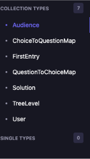

# Strapi and Site walkthrough

## Context
This is a non-technical walk through for John and other doctors that are expected or wold like to use and continue adding and updating the website. 

## Brief Overview
Strapi provides a way to easily view and manage our database/ tree structure through its content management system (CMS). This is also where we store all of the data for this project

### Getting started
First log into Strapi’s backend content management system:
This is the website to our official and deployed Strapi: 
https://se-bch-als-resource-app-production.up.railway.app/admin/auth/login
We have made a general account that you can sing up to use: 
Username:gwxzhang@bu.edu
Password: BCHADMIN1519

### Different settings
The three main things we only need to care about is content manager, content-type builder and settings. “Settings” is where admins can give permissions and access to other users. Content-Type Builder, deals with the logic of the connection between different entries. “Content Manager” is where we can access our tree structure and make changes to be displayed.

### Content Manager
To access the data and manage the tree structure select “Content Management”.
You can see your collection types after: (Collections types could change). These are individual layers in your tree diagram, or how one choice leads to another choice. 

It’s recommended to follow the tree diagram on Figma, to be more accurate and less prone to error when making changes. It is also important to note that relationships between choices, which represent a button selection and a question as the question on the page, which one will be answering. These relations are one-to-one. 

### Using the right collection type
Like the tree type suggests, if the input data is a choice selection we would put the data into ChoiceToQuestionMap. And likewise if the input is a question we will put that into the QuestionToChoiceMap.

### Adding data
For example if you want to add a new data under the ChoiceToQuestionMap, click on that type. In the middle there is a “Create new entry” button, click on that. Then, depending on the content type you should see a screen like this: 
 

 ### Permissions

 Returning to the homepage by clicking on the “Strapi Dashboard workplace” on the top right corner. To give permissions to yourself or others to be able to manage this system click on “Settings” -> under Administration Panel and Users & Permissions Plugin, you can select “Roles” or “Users”. There will be premade roles but there will also be a feature where you can make a new role. For these roles you can give different levels of access based on what control you want them to have. 